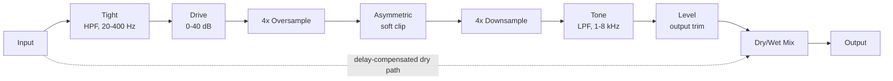

# Architecture

## Signal flow

Everything from the Tight HPF through Level is the "wet" path, owned by `OvertureEngine` (`src/dsp/OvertureEngine.{h,cpp}`). The dry path is the untouched input signal, delayed to stay time-aligned with the wet path (see [Latency and oversampling](#latency-and-oversampling) below), then blended in at the Mix stage via `juce::dsp::DryWetMixer`.

## Module map

| Directory | Responsibility |
|---|---|
| `src/dsp` | All audio-thread DSP: `AsymSoftClipper` (the stateless nonlinearity) and `OvertureEngine` (the full signal chain: Tight HPF, Drive gain, oversampling + clip, Tone LPF, Level gain, dry/wet mix). No allocation, locks, or I/O once `prepare()` has run. Independent of `juce::AudioProcessor` so it is directly unit-testable (see `tests/EngineTests.cpp`, `tests/AsymSoftClipperTests.cpp`). |
| `src/params` | Parameter layout and `AudioProcessorValueTreeState` definitions - parameter IDs, ranges, defaults. Single source of truth for what a preset captures. |
| `src/PluginProcessor.*` | Host plumbing: APVTS construction, `prepareToPlay`/`processBlock`/`reset`, latency reporting, state save/load. Reads APVTS values and pushes them into `OvertureEngine` every block; does not implement any DSP itself. |
| `src/PluginEditor.*` | A simple, functional v0.1 GUI: one rotary slider per parameter bound via `SliderAttachment`. A custom vector-drawn GUI is a later milestone. |

Dependency direction is one-way: `PluginEditor` -> `params` (via attachments) and `PluginProcessor` -> `params` + `dsp`. `src/dsp` has no upward dependency on the processor or UI, which is what keeps `OvertureEngine` testable in isolation.

## Latency and oversampling

The clipper runs inside a 4x oversampled block (`juce::dsp::Oversampling<float>`, half-band polyphase IIR, `useIntegerLatency = true`) so that the clipper's high-frequency harmonics are generated and filtered at 4x the host sample rate before being downsampled back, keeping aliasing out of the audible band. This oversampling is the only source of the plugin's reported latency: `OvertureEngine::getLatencySamples()` returns `oversampler.getLatencyInSamples()` (an exact integer, since `useIntegerLatency` is enabled), and `OvertureAudioProcessor::prepareToPlay()` reports it to the host via `setLatencySamples()`, so host-side plugin delay compensation (PDC) accounts for the whole chain.

The dry path used by the Mix control has to stay time-aligned with this delayed wet path. Rather than a hand-rolled delay line, `OvertureEngine` uses `juce::dsp::DryWetMixer`: the pre-processing signal is captured via `pushDrySamples()` before any wet-path filtering touches the buffer, and `setWetLatency(getLatencySamples())` configures the mixer's internal delay line to match. `mixWetSamples()` then blends the two back together, so at Mix = 0% the output is a sample-accurate passthrough of the input, once shifted by `getLatencySamples()` (this is exactly what `tests/EngineTests.cpp`'s null test verifies, to < -90 dBFS residual).

One JUCE 8.0.14 behaviour worth calling out because it cost real debugging time (see `tests/DryWetMixerContractTests.cpp`): `DryWetMixer`'s internal dry/wet gain smoothers default their *target* to fully wet (`mix == 1.0`) until `setWetMixProportion()` is called, and the mixer's own `reset()` (invoked from its `prepare()`) only snaps the smoothers' *current* value to whatever *target* is set at that moment - it has no idea what the "real" starting Mix parameter value should be. Skipping this would mean a freshly prepared engine audibly ramps in from 100% wet over the mixer's internal ~50ms default ramp on every `prepareToPlay()`, regardless of the actual Mix parameter. `OvertureEngine::prepare()` works around this by calling `dryWetMixer.setWetMixProportion(lastMixProportion)` *before* its own `reset()` runs, so the mixer is already sitting at the correct dry/wet balance from the very first `process()` call.

The Tight (high-pass) and Tone (low-pass) filters are plain 2nd-order Butterworth IIR filters (`juce::dsp::IIR::Coefficients::makeHighPass`/`makeLowPass`, Q = 1/sqrt(2)) and are not part of the reported latency - like any IIR filter, they have their own small, frequency-dependent group delay (a few samples at most, well outside their passband), which is treated as ordinary filter character rather than something to compensate. `tests/EngineTests.cpp`'s near-linearity test accounts for this by searching a small (+/-8 sample) alignment window rather than assuming an exact match at the oversampling latency alone.

## Parameter smoothing

- **Drive** and **Level** are plain gain stages (`juce::dsp::Gain<float>`), which ramp sample-accurately via their own internal `SmoothedValue` (`setRampDurationSeconds`).
- **Tight** and **Tone** are filter cutoff frequencies. Recomputing IIR coefficients involves trig calls, so these are not cheap to interpolate per sample; instead, each is smoothed with a `juce::SmoothedValue<float, ValueSmoothingTypes::Multiplicative>` (multiplicative smoothing suits frequencies, which are perceived logarithmically) and the filter coefficients are recomputed once per block from the smoothed value - a standard real-time-safe compromise.
- **Mix** is smoothed both by the engine's own `juce::SmoothedValue<float, ValueSmoothingTypes::Linear>` (feeding `DryWetMixer::setWetMixProportion()` once per block) and by `DryWetMixer`'s own internal ~50ms ramp on top of that.
- All smoothers are seeded to their real starting value in `OvertureEngine::prepare()` (see `lastTightHz`/`lastToneHz`/`lastMixProportion`), so re-preparing (sample-rate change, etc.) never resets a live parameter back to a built-in default or lets a smoother ramp from an invalid 0 Hz/0.0 starting point.

## Real-time safety

- `OvertureAudioProcessor::processBlock()` starts with `juce::ScopedNoDenormals`.
- All DSP state (filters, the oversampler, the dry/wet delay line) is allocated in `prepare()`/`prepareToPlay()` and never reallocated on the audio thread.
- `reset()` clears all filter/oversampler/delay-line state without deallocating (`OvertureEngine::reset()`, called from both `AudioProcessor::reset()` and internally from `prepare()`).
- Parameter values are read via `apvts.getRawParameterValue()` atomics in `processBlock()`, never via `apvts.getParameter()->getValue()` (which is not guaranteed lock/allocation-free) and never via `String`-keyed lookups on the audio thread.
- `OvertureEngine::process()` treats a zero-sample block as a safe no-op before touching any filter/oversampler state.
- Filter cutoff frequencies passed to `IIR::Coefficients::makeHighPass`/`makeLowPass` are clamped below Nyquist (`clampBelowNyquist`, in `OvertureEngine.cpp`) as defensive insurance against invalid coefficients if the plugin is ever prepared at an unusually low sample rate.
