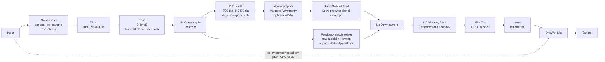

# Architecture

## Signal flow (v0.3.0)



Everything from the Tight HPF through Level is the "wet" path, owned by `OvertureEngine` (`src/dsp/OvertureEngine.{h,cpp}`). The dry path is the untouched input signal, delayed to stay time-aligned with the wet path (see [Latency and oversampling](#latency-and-oversampling) below), then blended in at the Mix stage via `juce::dsp::DryWetMixer`. **Bypass** (`ParamIDs::bypass`) reuses this exact same path: `OvertureAudioProcessor::processBlock()` forces the *effective* Mix proportion fed to the engine to 0% while bypassed (regardless of the user's actual Mix setting), rather than skipping `OvertureEngine::process()` altogether - see [Bypass](#bypass) below.

This is the same v0.1 oversampling/latency/dry-wet architecture unchanged - v0.2.0 (`docs/design-brief.md`) only changes what happens *inside* Drive -> Clipper -> Tone, not the surrounding real-time-safety contract. v0.3.0 adds stages at both ends of that section (the gate in front, the DC blocker behind) and one alternative path through it (the Feedback voicing), again without touching the latency/dry-wet contract: reported latency is unchanged at every oversampling factor.

### Noise gate (new in v0.3.0)

`src/dsp/NoiseGate.h`, gated behind `ParamIDs::gate`. Placement is deliberate and load-bearing:

- The **detector taps the plugin input** - before Tight, before Drive. That is the cleanest signal available inside the plugin and the closest in-plugin analogue to keying a hardware gate from the instrument, so the threshold means the same thing regardless of how Tight and Drive are set.
- The **gain is applied to the wet path input**, before the Tight HPF, so gated noise never reaches the clipper at all rather than being clipped and then attenuated.
- The **dry path is ungated**. `dryWetMixer.pushDrySamples()` runs *before* the gate, so a Mix below 100% still passes the untreated input. The gate belongs to the wet pedal chain; this is documented in `docs/manual.md` because it is a real, user-visible consequence.
- **Stereo linked**: one detector fed by the max of |x| across channels, one gain applied to both, so the image cannot wander as the gate works.

The control path runs **per sample**, in the log/dB domain (the placement Giannoulis, Massberg & Reiss, JAES 60(6) 2012 recommend for log-domain dynamics): a 5 ms exponential mean-square detector behind a fixed 100 Hz/5 kHz TPT-SVF sidechain pair, then a non-linear-capacitor smoother whose effective time constant collapses from 30 ms to 2 ms as the level step grows past a 1.5 dB knee, then a hysteresis/hold state machine, then the gain ramps. A block-rate control path chatters; this one does not.

Two properties are worth calling out because they are what the tests actually pin down (`tests/NoiseGateTests.cpp`):

- The **closing ramp is dB-linear** (`g[n] = max(g[n-1] - S/fs, -M)`), the VCA/THAT-DN100 signature, not the exponential-in-linear-gain ramp most digital gates use. T-G4 line-fits `20*log10(gain)` and demands `R^2 > 0.99`, which an exponential release could not pass at the same endpoints.
- The **auto release is program-dependent**: a fast and a slow envelope run on the detector output, and when the slow one gets more than 4 dB above the fast one the note has stopped abruptly, so the slow envelope is dumped and the gate releases at 1000 dB/s; otherwise it releases at the note's own measured decay rate plus 15 dB/s of margin. T-G6 checks both halves with the same settings and different programme material.

Zero added latency: there is no lookahead in v0.3.0 (deferred - it would make reported latency a function of a parameter, which needs a settled suite-wide latency-renegotiation pattern first).

### Feedback voicing: a circuit solver, not a curve (new in v0.3.0)

`src/dsp/FeedbackClipperStage.h`, selected by `ClipperVoicing::feedback` (index 3, appended - 0-2 frozen). It replaces the Bite-shelf -> memoryless-clipper -> Knee-Soften section entirely while it is selected, and runs inside the same oversampler.

The stage integrates

```
dV/dt = In/Cc - V/(R2*Cc) - iD(V)/Cc,   In(s) = Vi * s / (R1*(s + wz))
```

by the trapezoidal rule, solving the resulting implicit equation per sample with a safeguarded Newton iteration, and outputs `Vo = Vi + V`. What that buys over a waveshaper is **memory**: the 51 pF feedback capacitor puts a drive-dependent lowpass pole *inside* the nonlinearity (~61 kHz at Drive 0, ~5.7 kHz at Drive max), so the stage's gain, its knee and its high-frequency rounding move together with the signal and with Drive. No memoryless transfer curve reproduces that at any oversampling factor.

Consequences that are deliberate, not omissions:

- **Drive maps to the feedback resistance** `R2 = 51k + D*500k`, smoothed multiplicatively in the resistance domain, and the plain pre-clipper Drive gain is forced to 0 dB - the circuit computes its own 21.5-41.4 dB of in-band loop gain.
- **Bite and Knee Soften are inert.** The circuit's own 720 Hz pre-emphasis *is* the bite mechanism and its knee is physical. `tests/EngineTests.cpp` T-E2 asserts this bit-exactly rather than documenting it.
- **The DC blocker is always on** for this voicing (the asymmetry-morphable diode law produces programme-dependent DC).
- **Calibration is pinned in the small-signal regime.** `V_SCALE = 2.0 V` per full scale, so -12 dBFS is 0.5 V; with ~21.5 dB of minimum in-band gain into a ~0.4 V knee, the linear region at Drive 0 ends around -40...-35 dBFS. This voicing is a touch-sensitive **programme-level** clipper by design, and `tests/FeedbackClipperTests.cpp` T-F1 asserts both halves of that: THD < 0.1% at -60 dBFS, and THD > 10% at -12 dBFS with golden-matched harmonics. A "clean at -12 dBFS" result would mean a broken solver or a mis-scaled `V_SCALE`, and fails.

The solver's bracket is diode-aware - `min(p/(1+a), mf*n*VT*ln(1 + p/(R2*Is)))` rather than the linear bound alone - which is what keeps the iteration inside the physically reachable +/-0.7 V and lets the 8-iteration cap be hard rather than best-effort. `g` is strictly monotone, so the bisection fallback is guaranteed to terminate.

### Enhanced clip quality: ADAA + DC blocker (new in v0.3.0)

`src/dsp/AdaaWaveshaper.h` and `src/dsp/DcBlocker.h`, behind `ParamIDs::clipQuality`. First-order antiderivative anti-aliasing (Parker, Zavalishin & Le Bivic, DAFx-16) convolves each memoryless voicing with a one-sample box kernel analytically:

```
y~(n) = (F(u(n)) - F(u(n-1))) / (u(n) - u(n-1)),   F' = f
```

falling back to the midpoint evaluation `f((u(n)+u(n-1))/2)` where the denominator collapses, guarded by an input-scaled epsilon. Closed-form antiderivatives are used for all three voicings, with an overflow-safe large-|x| branch for `ln(cosh)`.

This header **wraps** the voicing functions and never edits them: `Classic` still calls `ClipperVoicings::processSample()` directly and remains bit-identical to v0.2.0. Two documented side effects, neither reported as latency: a half-sample group delay *at the oversampled rate*, and a mild `(1 + z^-1)/2` HF droop, also at the oversampled rate.

Measured (`tests/AdaaTests.cpp` T-A1, bin-centred 1245 Hz into Hard Clip at 0 dBFS/Drive 40): alias energy of -23.8 dBFS (Classic 2x) vs -42.5 dBFS (Enhanced 2x), and -33.2 vs -57.0 dBFS at 4x. Enhanced at 2x beats Classic at 4x.

### Sub-block parameter updates (new in v0.3.0)

`OvertureEngine::processChunk()` now splits each chunk into 32-sample sub-blocks and runs the whole base-rate chain per sub-block (`processSubBlock()`), raising the coefficient-update cadence from ~86 Hz to ~1.5 kHz at 48 kHz/512. Two details make this safe:

- Every stage it touches - the IIR filters, the polyphase oversampler, the `DryWetMixer` delay line, `juce::dsp::Gain` - is block-size invariant, so splitting the work cannot change the output on its own. `tests/EngineTests.cpp` asserts that a settled engine produces bit-identical output at host block sizes of 64, 128, 37 and 511.
- A coefficient is only re-derived when its smoothed value has actually moved (epsilon compare), so a settled parameter never re-enters the `ArrayCoefficients` path and the steady-state output stays bit-identical to v0.2.0. `prepare()` deliberately resets the "last applied" trackers to an impossible sentinel, because `prepare()`'s own priming uses the *allocating* `IIR::Coefficients` factory whose result can differ by an ULP from the `ArrayCoefficients` path the running engine uses - v0.2.0 always landed on the latter from the first block, and so must v0.3.0.

### Frozen non-parameter constants (v0.3.0)

These are hardware-derived or circuit-derived values, not user controls. Nothing persists them, so they can be re-tuned pre-release without any state-schema impact.

| Constant | Value | Where |
|---|---|---|
| Gate hysteresis `H` | 4 dB | `NoiseGate::hysteresisDb` |
| Gate hold | 20 ms, retriggering | `NoiseGate::holdSeconds` |
| Gate range/floor `M` | 90 dB | `NoiseGate::rangeDb` |
| Gate attack `tau` | 0.1 ms | `NoiseGate::attackTauSeconds` |
| Gate detector `tau` | 5 ms (mean square) | `NoiseGate::detectorTauSeconds` |
| NLC smoother | 2 ms / 30 ms, 1.5 dB knee | `NoiseGate::nlcTau*`, `nlcKneeDb` |
| Sidechain filters | 100 Hz HPF, 5 kHz LPF, 2nd order | `NoiseGate::sidechain*Hz` |
| TVP window / slopes | 4 dB; 1000 dB/s fast, decay + 15 dB/s tracked | `NoiseGate::tvp*` |
| Fixed release slopes | 800 dB/s (Fast), 60 dB/s (Slow) | `NoiseGate::fastSlopeDbPerSecond`, `slowSlopeDbPerSecond` |
| Gate seed grace | 30 ms | `NoiseGate::seedGraceSeconds` |
| Feedback circuit | R1 4.7k, Cz 47n, Cc 51p, R2 51k + D*500k, Is 2.52n, n 1.75, VT 25.85m | `FeedbackClipperStage` |
| Voltage calibration | `V_SCALE` 2.0 V per full scale | `FeedbackClipperStage::voltageScale` |
| Feedback output trim | 0 dB | `FeedbackClipperStage::outputTrimDb` |
| DC blocker corner | 5 Hz | `DcBlocker::cornerHz` |
| Knee envelope release | 30 ms (at the oversampled rate) | `OvertureEngine::kneeEnvelopeReleaseSeconds` |
| Sub-block size | 32 base-rate samples | `OvertureEngine::subBlockSizeDefault` |

### State schema

`getStateInformation()` stamps a `stateSchema` attribute on the saved XML root; v0.3.0 writes `"3"`. Absence of the attribute means v0.1 (if a `tone` PARAM node is present) or v0.2 (otherwise). **No value rewriting happens for v2 -> v3**: every v0.3.0 parameter's default *is* the v0.2.0-equivalent neutral value, and APVTS already ignores unknown PARAM nodes and falls back to defaults for missing ones. The attribute exists so a future migration can branch on an explicit version instead of sniffing for individual parameters. `tests/StateTests.cpp` T-S1/T-S2 assert both halves: the defaults are neutral, and an engine restored from v0.2.0-shaped state is bit-identical to an explicitly configured one.

### Bite: frequency-dependent gain inside the drive-to-clipper path (new in v0.2.0)

`ParamIDs::biteAmount` (0-100%, default 65%) is **not** a pre-clip filter - it is a low-shelf (`biteShelf`, `juce::dsp::IIR`, corner fixed at 700 Hz) that runs *inside* the oversampled block, applied to the drive-scaled signal immediately before the voicing dispatch. It reduces the amplitude fed to the clipper below the shelf corner, scaled by `biteAmount` (up to 12 dB of cut at 100%), so bass is clipped *less* than treble - reproducing the reference circuit's own frequency-selective clipping mechanism (`docs/research-notes.md` SS3), not approximating its output with a separate filter ahead of the gain stage (v0.1's Tight control still does that job, unchanged, for the *pre-clip* tightening role).

At `biteAmount = 0`, the shelf is **skipped entirely** (no filter call, not merely given unity-gain coefficients) - this is what makes `bite_amount = 0` bit-identical to v0.1's flat-gain clipper input, the core regression guarantee `docs/design-brief.md` requires. `tests/EngineTests.cpp`'s frequency-dependent-gain proof feeds matched-level low/high-frequency sines through the clipper at a fixed Drive and confirms the measured clip-onset (peak) gap between them grows monotonically as `biteAmount` sweeps 0% -> 100%.

### Knee Soften: drive-dependent knee softening (new in v0.2.0)

`ParamIDs::kneeSoften` (0-100%, default 40%) blends each voicing's raw transfer-function output toward a rounded-corner variant (`src/dsp/KneeSoftening.h`: `raw + blend * (tanh(raw) - raw)`), where the blend amount is `(kneeSoften/100) * driveIntensity`, and `driveIntensity` is a real-time-safe, block-rate proxy for how hard the clipper is currently being driven (the last-commanded Drive dB value normalised against Drive's own 0-40 dB range). This reproduces the reference circuit's own knee-softening-cap behaviour (`docs/research-notes.md` SS3: "softens the corners... most noticeable when the drive control is maxed out") - the knee gets audibly softer as Drive increases, for a fixed `kneeSoften > 0`.

Applies uniformly to all three voicings, including Hard Clip, which has literally zero knee at `kneeSoften = 0` at any Drive level (a razor-sharp clamp) - `tanh()` rounding its otherwise-flat +/-1 ceiling is what makes it genuinely softenable. At `kneeSoften = 0`, the blend is always exactly 0 regardless of Drive (skipped, not called with a 0 blend), reproducing v0.1's Drive-invariant fixed-knee behaviour exactly.

### Asymmetry (new in v0.2.0)

`ParamIDs::asymmetryAmount` (0-100%, default 40%) exposes what was a fixed internal constant (`a = 0.2`) in v0.1's `AsymSoftClipper`, mapping linearly to the bias `a` in 0.0-0.5. Only the Asymmetric voicing consumes it (`ClipperVoicings::processSample`, `src/dsp/ClipperVoicing.h` - unchanged from v0.1, since it already took `asymmetry` as a parameter); Soft Symmetric and Hard Clip ignore it, exactly as in v0.1. The default 40% maps to `a = 0.2`, reproducing v0.1's fixed default exactly.

### Clipper voicing

The nonlinearity inside the oversampled block is selectable via the **Voicing** parameter (`ParamIDs::voicing`, `src/dsp/ClipperVoicing.h`) - unchanged from v0.1, and its enum indices remain frozen:

| Voicing | Transfer function | Character |
|---|---|---|
| Asymmetric (default) | `tanh(x + a) - tanh(a)`, `a` now variable via Asymmetry (`AsymSoftClipper`) | Single-ended/op-amp-style biased soft clip - the original v0.1 "808 boost" voicing. Both odd and even harmonics. |
| Soft Symmetric | `tanh(x)` (`SoftSymmetricClipper`) | Unbiased, odd-symmetric soft clip - smoother, push-pull/fuzz-adjacent saturation, odd harmonics only. |
| Hard Clip | `clamp(x, -1, 1)` (`HardClipper`) | No soft knee at `kneeSoften = 0` - the brightest/most aggressive voicing, more high-order odd harmonics; softenable via Knee Soften like the other two. |

`OvertureEngine::setClipperVoicing()` just stores the selected enum value (no allocation); `processChunk()` dispatches to the corresponding function once per (oversampled) sample via `ClipperVoicings::processSample()`, then conditionally blends through `KneeSoftening::apply()`. Voicing changes are **not** smoothed/crossfaded - a discrete mode switch causing an audible step at the switch instant is treated as expected, stompbox-toggle-like behaviour rather than a bug.

### Bite Tilt: post-clip bidirectional shelf (replaces v0.1's Tone LPF)

`ParamIDs::biteTilt` (-100%..+100%, default 0%) replaces v0.1's cut-only, 4th-order-Butterworth `tone` low-pass with a single 2nd-order RBJ-cookbook high-shelf (`biteTiltShelf`) anchored at a fixed ~3 kHz corner (reasoned proxy for the sourced ~3.2 kHz reference-circuit tone-tilt corner, `docs/research-notes.md` SS3). Negative values cut the shelf gain (darken, subsuming v0.1's entire cut-only range), positive values boost it (brighten) - a capability v0.1 entirely lacked. JUCE 8.0.14's `juce::dsp::IIR::(Array)Coefficients` has no true first-order shelf, so this uses the standard 2nd-order shelf with `Q = 1/sqrt(2)` (the same maximally-flat, non-resonant Q as the Tight HPF), the closest built-in equivalent to the brief's "roughly first-order/6 dB-oct" target.

At `biteTilt = 0`, the filter is **skipped entirely** (a true no-op, not a unity-gain filter call) - `tests/EngineTests.cpp`'s bidirectionality tests confirm flat is a genuine no-op, that negative/positive values darken/brighten monotonically, and that the fully-negative setting is at least as dark as v0.1's fully-closed Tone at a matched test frequency (measured directly against v0.1's own retired 4th-order cascade formula, not assumed).

**Migration:** a v0.1 saved session's `tone` value (1-8 kHz, cut-only) has no exact equivalent in the new bidirectional parameter - `OvertureAudioProcessor::setStateInformation()` detects a legacy `tone` PARAM node before `apvts.replaceState()` runs (a v0.1 XML tree has no `biteTilt` node at all for `replaceState()` to apply) and lossily maps it: 1000 Hz (v0.1's fully-closed/darkest Tone) -> -100% (maximally negative), 8000 Hz (fully-open/brightest) -> 0% (flat), linearly in between. This is a best-effort, not mathematically exact, equivalence - `docs/design-brief.md`'s "Migration" section documents this explicitly. Every other v0.2.0-only parameter falls back to its own default (not zero/garbage) on a legacy load.

### Bypass

`ParamIDs::bypass` (`juce::AudioParameterBool`) is returned from `OvertureAudioProcessor::getBypassParameter()`, which is JUCE's mechanism (JUCE 8.0.14, `juce::AudioProcessor::getBypassParameter()`) for AU/VST3/AAX/LV2 hosts to treat a plugin's own parameter as native bypass rather than calling the (here, unimplemented) `processBlockBypassed()`. `processBlock()` checks the parameter itself every block and forces the engine's effective Mix proportion to 0% while bypassed - the oversampler keeps running unchanged, so the plugin's reported latency (and therefore host plugin-delay-compensation) never changes on a bypass toggle. Because this goes through the same smoothed Mix path as a normal Mix automation move (`mixSmoothed` + `DryWetMixer`'s own internal ramp, see [Parameter smoothing](#parameter-smoothing)), engaging/disengaging Bypass mid-stream crossfades over roughly 100 ms rather than clicking - this is intentional (avoids a bypass-toggle pop), not a limitation; `tests/RobustnessTests.cpp`'s bypass null test accounts for it with an explicit warm-up period before measuring.

### Oversampling factor

`ParamIDs::oversampling` (`juce::AudioParameterChoice`: "2x"/"4x"/"8x", default 4x) selects `OvertureEngine`'s oversampling factor via `setOversamplingFactorPow2()`. Reconstructing the internal `juce::dsp::Oversampling` instance allocates, so `setOversamplingFactorPow2()` only ever *records* the requested factor - the actual (re)construction happens inside `OvertureEngine::prepare()`, called only from `OvertureAudioProcessor::prepareToPlay()` (never from `processBlock()`). Consequently, changing this parameter while audio is running takes effect the next time the host calls `prepareToPlay()` (transport stop/start, sample-rate change, reopening the plugin, etc.), not instantaneously - a deliberate trade-off to keep the audio thread allocation-free rather than building a message-thread-driven live-reconfiguration mechanism for a rarely-automated "quality" setting. `tests/LatencyTests.cpp` covers both the engine-level behaviour and this processor-level "change takes effect on next prepare" contract. The Bite shelf's own `ProcessSpec` (sample rate `sampleRate * oversampler->getOversamplingFactor()`) is derived from this factor inside the same `prepare()` call.

One JUCE 8.0.14-specific detail worth calling out: `juce::dsp::Oversampling` with `useIntegerLatency = true` (as `OvertureEngine` uses) rounds each cascaded 2x stage's fractional latency to the nearest integer sample *independently*, which can make an additional oversampling stage not increase the *reported* integer latency - empirically, at 48 kHz this engine measures 4 samples at 2x and 6 samples at both 4x and 8x. Latency is guaranteed non-decreasing as the factor increases, not strictly increasing at every step; `tests/LatencyTests.cpp` asserts the former, not the latter.

## Module map

| Directory | Responsibility |
|---|---|
| `src/dsp` | All audio-thread DSP: `AsymSoftClipper`/`ClipperVoicing` (the stateless nonlinearities and the `ClipperVoicing` enum/dispatch, unchanged from v0.1 apart from the appended `feedback` value), `KneeSoftening` (v0.2.0 - the stateless knee-rounding blend function), `RealtimeCoefficients` (allocation-free biquad coefficient writes, `ovtr::applyBiquadCoefficients`), and - new in v0.3.0 - `EnvelopeFollower` (shared peak/mean-square followers), `NoiseGate` (detector, sidechain SVFs, state machine, TVP release), `FeedbackClipperStage` (the trapezoidal/Newton circuit solver), `AdaaWaveshaper` (first-order ADAA around the memoryless voicings) and `DcBlocker`, plus `OvertureEngine` (the full signal chain). No allocation, locks, or I/O once `prepare()` has run. Independent of `juce::AudioProcessor` so it is directly unit-testable (see `tests/EngineTests.cpp`, `tests/AsymSoftClipperTests.cpp`, `tests/ClipperVoicingTests.cpp`, `tests/KneeSofteningTests.cpp`). |
| `src/params` | Parameter layout and `AudioProcessorValueTreeState` definitions - parameter IDs, ranges, defaults. Single source of truth for what a preset captures. |
| `src/presets` | M2 preset system (`.scaffold/specs/preset-system-m2.md`): `PresetManager` (factory/user preset discovery, load/save/import/export, dirty tracking, default resolution) and `PresetBar` (the editor strip), plus `Localisation` (the M2 i18n frame, `resources/i18n/de.txt`). Copied verbatim from the Nave pilot implementation - see `docs/design-brief.md`. |
| `src/PluginProcessor.*` | Host plumbing: APVTS construction, `prepareToPlay`/`processBlock`/`reset`, latency reporting, state save/load (including the v0.1 `tone` -> v0.2.0 `biteTilt` migration), `getBypassParameter()`, `PresetManager` construction/wiring. Reads APVTS values and pushes them into `OvertureEngine` every block; does not implement any DSP itself. |
| `src/PluginEditor.*` | A simple, functional v0.1/v0.2 GUI: one rotary slider per continuous parameter (`SliderAttachment`), a toggle for Bypass (`ButtonAttachment`), combo boxes for the discrete Voicing/Oversampling choices (`ComboBoxAttachment`), and the `PresetBar` strip docked at the top. Every automatable parameter has a working control; a custom vector-drawn GUI is a later milestone (M3). |

Dependency direction is one-way: `PluginEditor` -> `params`/`presets` (via attachments) and `PluginProcessor` -> `params` + `dsp` + `presets`. `src/dsp` has no upward dependency on the processor or UI, which is what keeps `OvertureEngine` testable in isolation.

## Latency and oversampling

The clipper (and, as of v0.2.0, the Bite shelf ahead of it) runs inside an oversampled block (`juce::dsp::Oversampling<float>`, half-band polyphase IIR, `useIntegerLatency = true`, factor selectable 2x/4x/8x - see [Oversampling factor](#oversampling-factor) above) so that the clipper's high-frequency harmonics are generated and filtered above the host sample rate before being downsampled back, keeping aliasing out of the audible band. This oversampling is the only source of the plugin's reported latency: `OvertureEngine::getLatencySamples()` returns `oversampler.getLatencyInSamples()` (an exact integer, since `useIntegerLatency` is enabled), and `OvertureAudioProcessor::prepareToPlay()` reports it to the host via `setLatencySamples()`, so host-side plugin delay compensation (PDC) accounts for the whole chain. Bite Tilt and Level run post-downsample, at the base sample rate, and are not part of the reported latency.

The dry path used by the Mix control has to stay time-aligned with this delayed wet path. Rather than a hand-rolled delay line, `OvertureEngine` uses `juce::dsp::DryWetMixer`: the pre-processing signal is captured via `pushDrySamples()` before any wet-path filtering touches the buffer, and `setWetLatency(getLatencySamples())` configures the mixer's internal delay line to match. `mixWetSamples()` then blends the two back together, so at Mix = 0% the output is a sample-accurate passthrough of the input, once shifted by `getLatencySamples()` (this is exactly what `tests/EngineTests.cpp`'s null test verifies, to < -90 dBFS residual, now with every v0.2.0 control also set to a non-neutral value).

One JUCE 8.0.14 behaviour worth calling out because it cost real debugging time (see `tests/DryWetMixerContractTests.cpp`): `DryWetMixer`'s internal dry/wet gain smoothers default their *target* to fully wet (`mix == 1.0`) until `setWetMixProportion()` is called, and the mixer's own `reset()` (invoked from its `prepare()`) only snaps the smoothers' *current* value to whatever *target* is set at that moment - it has no idea what the "real" starting Mix parameter value should be. Skipping this would mean a freshly prepared engine audibly ramps in from 100% wet over the mixer's internal ~50ms default ramp on every `prepareToPlay()`, regardless of the actual Mix parameter. `OvertureEngine::prepare()` works around this by calling `dryWetMixer.setWetMixProportion(lastMixProportion)` *before* its own `reset()` runs, so the mixer is already sitting at the correct dry/wet balance for the very first `process()` call.

The Tight high-pass, Bite shelf, and Bite Tilt shelf are all plain IIR filters (`juce::dsp::IIR::Coefficients::makeHighPass`/`makeLowShelf`/`makeHighShelf`, primed once in `prepare()`, then re-derived every processed chunk via the allocation-free `juce::dsp::IIR::ArrayCoefficients` + `ovtr::applyBiquadCoefficients` path - see `src/dsp/RealtimeCoefficients.h`); none is part of the reported latency - like any IIR filter, each has its own small, frequency-dependent group delay (a few samples at most, well outside its passband), treated as ordinary filter character rather than something to compensate. `tests/EngineTests.cpp`'s near-linearity test accounts for this by searching a small (+/-8 sample) alignment window rather than assuming an exact match at the oversampling latency alone.

`OvertureEngine::process()` also defensively chunks any block larger than the size declared to `prepare()` (`preparedMaxBlockSize`) into `processChunk()` calls of at most that size, since the oversampler's and `DryWetMixer`'s internal buffers are both fixed to that size and only guard the invariant with a `jassert` (compiled out in Release builds) - `tests/EngineTests.cpp` verifies this produces bit-identical output to what a well-behaved, correctly-chunking host would get.

## Parameter smoothing

- **Drive** and **Level** are plain gain stages (`juce::dsp::Gain<float>`), which ramp sample-accurately via their own internal `SmoothedValue` (`setRampDurationSeconds`).
- **Tight**, **Bite**, **Knee Soften**, **Asymmetry**, and **Bite Tilt** all recompute filter coefficients or blend factors once per processed chunk rather than per sample - recomputing IIR coefficients involves trig calls, so this is not cheap to interpolate directly; each is smoothed with a `juce::SmoothedValue` (`Multiplicative` for the frequency-perceived-logarithmically Tight; `Linear` for the rest, all percentages/proportions) and re-applied once per chunk - a standard real-time-safe compromise. Knee Soften's own drive-dependence uses the last-commanded Drive dB value directly (not itself smoothed - `juce::dsp::Gain` doesn't expose a "current ramped value" getter), the same block-rate-snapshot compromise the coefficient recomputation already makes.
- **Mix** is smoothed both by the engine's own `juce::SmoothedValue<float, ValueSmoothingTypes::Linear>` (feeding `DryWetMixer::setWetMixProportion()` once per chunk) and by `DryWetMixer`'s own internal ~50ms ramp on top of that. **Bypass** reuses this exact path (see [Bypass](#bypass) above), so it inherits the same smoothing.
- **Voicing** and **Oversampling** are discrete choices, not smoothed: Voicing switches the clipper nonlinearity instantly (an audible step at the switch instant is expected, like a stompbox toggle); Oversampling only takes effect on the next `prepare()` call (see [Oversampling factor](#oversampling-factor) above), so there is nothing to smooth mid-stream.
- All smoothers are seeded to their real starting value in `OvertureEngine::prepare()` (see `lastTightHz`/`lastBiteAmountPercent`/`lastKneeSoftenPercent`/`lastAsymmetryAmountPercent`/`lastBiteTiltPercent`/`lastMixProportion`), so re-preparing (sample-rate change, etc.) never resets a live parameter back to a built-in default or lets a smoother ramp from an invalid 0 Hz/0.0 starting point.

## Real-time safety

- `OvertureAudioProcessor::processBlock()` starts with `juce::ScopedNoDenormals`.
- All DSP state (filters, the oversampler, the Bite/Bite Tilt shelves, the dry/wet delay line) is allocated in `prepare()`/`prepareToPlay()` and never reallocated on the audio thread.
- `reset()` clears all filter/oversampler/delay-line state without deallocating (`OvertureEngine::reset()`, called from both `AudioProcessor::reset()` and internally from `prepare()`).
- Parameter values are read via `apvts.getRawParameterValue()` atomics in `processBlock()`, never via `apvts.getParameter()->getValue()` (which is not guaranteed lock/allocation-free) and never via `String`-keyed lookups on the audio thread.
- `OvertureEngine::process()` treats a zero-sample block as a safe no-op before touching any filter/oversampler state, and defensively chunks oversized blocks (see [Latency and oversampling](#latency-and-oversampling) above).
- Filter cutoff frequencies passed to coefficient-generation calls are clamped below Nyquist (`clampBelowNyquist`, in `OvertureEngine.cpp`) as defensive insurance against invalid coefficients if the plugin is ever prepared at an unusually low sample rate.
- Every per-chunk coefficient recompute (Tight HPF, Bite shelf, Bite Tilt shelf) uses `juce::dsp::IIR::ArrayCoefficients` (stack-computed) + `ovtr::applyBiquadCoefficients` (`src/dsp/RealtimeCoefficients.h`) rather than the allocating `IIR::Coefficients::make*()` calls (which `new` a fresh ref-counted object per call) - a permanent regression guard (`tests/AllocationTests.cpp`, globally instrumenting `operator new`/`delete`) fails the build if `processBlock()`/`OvertureEngine::process()` ever allocates while any control is being automated, extended in v0.2.0 to the Bite/Knee Soften/Asymmetry/Bite Tilt controls specifically.
- The Bite shelf and Bite Tilt shelf are **skipped entirely** (not called with unity-gain/zero-blend coefficients) when their controlling parameter is at its neutral value (`biteAmount = 0`, `biteTilt = 0`) or, for Knee Soften, when the computed blend is 0 - this is both a real-time-safety-neutral micro-optimisation and the mechanism that makes the "0% = v0.1-identical"/"flat = true no-op" backward-compatibility guarantees bit-exact rather than approximate.
- `OvertureEngine::setOversamplingFactorPow2()` never reallocates - it only records the requested factor as a plain `int` member; the actual (re)construction of `juce::dsp::Oversampling` happens exclusively inside `prepare()`, which is only ever called from `prepareToPlay()` (never `processBlock()`).
- `OvertureAudioProcessor::getBypassParameter()` implements bypass via the same allocation-free, atomics-driven Mix path as every other parameter (`bypassFlag->load()` in `processBlock()`), not via a separate code path or `processBlockBypassed()`.
- `PresetManager` (`src/presets/PresetManager.{h,cpp}`) never touches the audio thread - every public method does file I/O, JSON parsing, or `juce::String`/`juce::var` allocation, called only from the message thread (constructor, `PresetBar` UI callbacks). Its one audio-thread-adjacent code path, the `AudioProcessorValueTreeState::Listener::parameterChanged()` dirty-flag callback, is a single lock-free `std::atomic<bool>` store and nothing else.
