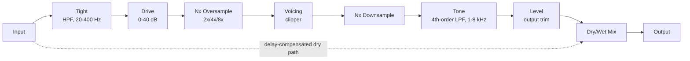

# Architecture

## Signal flow

Everything from the Tight HPF through Level is the "wet" path, owned by `OvertureEngine` (`src/dsp/OvertureEngine.{h,cpp}`). The dry path is the untouched input signal, delayed to stay time-aligned with the wet path (see [Latency and oversampling](#latency-and-oversampling) below), then blended in at the Mix stage via `juce::dsp::DryWetMixer`. **Bypass** (`ParamIDs::bypass`) reuses this exact same path: `OvertureAudioProcessor::processBlock()` forces the *effective* Mix proportion fed to the engine to 0% while bypassed (regardless of the user's actual Mix setting), rather than skipping `OvertureEngine::process()` altogether - see [Bypass](#bypass) below.

### Clipper voicing

The nonlinearity inside the oversampled block is selectable via the **Voicing** parameter (`ParamIDs::voicing`, `src/dsp/ClipperVoicing.h`):

| Voicing | Transfer function | Character |
|---|---|---|
| Asymmetric (default) | `tanh(x + a) - tanh(a)`, `a = 0.2` (`AsymSoftClipper`) | Single-ended/op-amp-style biased soft clip - the original v0.1 "808 boost" voicing. Both odd and even harmonics. |
| Soft Symmetric | `tanh(x)` (`SoftSymmetricClipper`) | Unbiased, odd-symmetric soft clip - smoother, push-pull/fuzz-adjacent saturation, odd harmonics only. |
| Hard Clip | `clamp(x, -1, 1)` (`HardClipper`) | No soft knee - the brightest/most aggressive voicing, more high-order odd harmonics. |

`OvertureEngine::setClipperVoicing()` just stores the selected enum value (no allocation); `process()` dispatches to the corresponding function once per (oversampled) sample via `ClipperVoicings::processSample()`. Voicing changes are **not** smoothed/crossfaded - a discrete mode switch causing an audible step at the switch instant is treated as expected, stompbox-toggle-like behaviour rather than a bug.

### Tone stack

Tone (`ParamIDs::tone`) is a 4th-order Butterworth low-pass, built as two cascaded 2nd-order `juce::dsp::IIR` sections sharing the same cutoff frequency but different Q (`toneFilterQ1 = 0.5411961`, `toneFilterQ2 = 1.3065630` - standard filter-cookbook values for a maximally-flat 4th-order cascade). This replaced the original v0.1 single 2nd-order section: 24 dB/octave roll-off tames post-clipper fizz substantially more effectively than 12 dB/octave for the same -3 dB point (empirically, ~-48 dB two octaves above cutoff for the 4th-order cascade vs. ~-24 dB for a single 2nd-order section - see `tests/EngineTests.cpp`'s tone-stack test). Both sections are prepared/reset/re-coefficiented together and are not part of the reported oversampling latency (same rationale as the Tight HPF below).

### Bypass

`ParamIDs::bypass` (`juce::AudioParameterBool`) is returned from `OvertureAudioProcessor::getBypassParameter()`, which is JUCE's mechanism (JUCE 8.0.14, `juce::AudioProcessor::getBypassParameter()`) for AU/VST3/AAX/LV2 hosts to treat a plugin's own parameter as native bypass rather than calling the (here, unimplemented) `processBlockBypassed()`. `processBlock()` checks the parameter itself every block and forces the engine's effective Mix proportion to 0% while bypassed - the oversampler keeps running unchanged, so the plugin's reported latency (and therefore host plugin-delay-compensation) never changes on a bypass toggle. Because this goes through the same smoothed Mix path as a normal Mix automation move (`mixSmoothed` + `DryWetMixer`'s own internal ramp, see [Parameter smoothing](#parameter-smoothing)), engaging/disengaging Bypass mid-stream crossfades over roughly 100 ms rather than clicking - this is intentional (avoids a bypass-toggle pop), not a limitation; `tests/RobustnessTests.cpp`'s bypass null test accounts for it with an explicit warm-up period before measuring.

### Oversampling factor

`ParamIDs::oversampling` (`juce::AudioParameterChoice`: "2x"/"4x"/"8x", default 4x) selects `OvertureEngine`'s oversampling factor via `setOversamplingFactorPow2()`. Reconstructing the internal `juce::dsp::Oversampling` instance allocates, so `setOversamplingFactorPow2()` only ever *records* the requested factor - the actual (re)construction happens inside `OvertureEngine::prepare()`, called only from `OvertureAudioProcessor::prepareToPlay()` (never from `processBlock()`). Consequently, changing this parameter while audio is running takes effect the next time the host calls `prepareToPlay()` (transport stop/start, sample-rate change, reopening the plugin, etc.), not instantaneously - a deliberate trade-off to keep the audio thread allocation-free rather than building a message-thread-driven live-reconfiguration mechanism for a rarely-automated "quality" setting. `tests/LatencyTests.cpp` covers both the engine-level behaviour and this processor-level "change takes effect on next prepare" contract.

One JUCE 8.0.14-specific detail worth calling out: `juce::dsp::Oversampling` with `useIntegerLatency = true` (as `OvertureEngine` uses) rounds each cascaded 2x stage's fractional latency to the nearest integer sample *independently*, which can make an additional oversampling stage not increase the *reported* integer latency - empirically, at 48 kHz this engine measures 4 samples at 2x and 6 samples at both 4x and 8x. Latency is guaranteed non-decreasing as the factor increases, not strictly increasing at every step; `tests/LatencyTests.cpp` asserts the former, not the latter.

## Module map

| Directory | Responsibility |
|---|---|
| `src/dsp` | All audio-thread DSP: `AsymSoftClipper`/`ClipperVoicing` (the stateless nonlinearities and the `ClipperVoicing` enum/dispatch) and `OvertureEngine` (the full signal chain: Tight HPF, Drive gain, oversampling + selectable clip, 4th-order Tone LPF, Level gain, dry/wet mix). No allocation, locks, or I/O once `prepare()` has run. Independent of `juce::AudioProcessor` so it is directly unit-testable (see `tests/EngineTests.cpp`, `tests/AsymSoftClipperTests.cpp`, `tests/ClipperVoicingTests.cpp`). |
| `src/params` | Parameter layout and `AudioProcessorValueTreeState` definitions - parameter IDs, ranges, defaults. Single source of truth for what a preset captures. |
| `src/PluginProcessor.*` | Host plumbing: APVTS construction, `prepareToPlay`/`processBlock`/`reset`, latency reporting, state save/load, `getBypassParameter()`. Reads APVTS values and pushes them into `OvertureEngine` every block; does not implement any DSP itself. |
| `src/PluginEditor.*` | A simple, functional v0.1 GUI: one rotary slider per continuous parameter (`SliderAttachment`), a toggle for Bypass (`ButtonAttachment`), and combo boxes for the discrete Voicing/Oversampling choices (`ComboBoxAttachment`). Every automatable parameter has a working control; a custom vector-drawn GUI is a later milestone (M3). |

Dependency direction is one-way: `PluginEditor` -> `params` (via attachments) and `PluginProcessor` -> `params` + `dsp`. `src/dsp` has no upward dependency on the processor or UI, which is what keeps `OvertureEngine` testable in isolation.

## Latency and oversampling

The clipper runs inside an oversampled block (`juce::dsp::Oversampling<float>`, half-band polyphase IIR, `useIntegerLatency = true`, factor selectable 2x/4x/8x - see [Oversampling factor](#oversampling-factor) above) so that the clipper's high-frequency harmonics are generated and filtered above the host sample rate before being downsampled back, keeping aliasing out of the audible band. This oversampling is the only source of the plugin's reported latency: `OvertureEngine::getLatencySamples()` returns `oversampler.getLatencyInSamples()` (an exact integer, since `useIntegerLatency` is enabled), and `OvertureAudioProcessor::prepareToPlay()` reports it to the host via `setLatencySamples()`, so host-side plugin delay compensation (PDC) accounts for the whole chain.

The dry path used by the Mix control has to stay time-aligned with this delayed wet path. Rather than a hand-rolled delay line, `OvertureEngine` uses `juce::dsp::DryWetMixer`: the pre-processing signal is captured via `pushDrySamples()` before any wet-path filtering touches the buffer, and `setWetLatency(getLatencySamples())` configures the mixer's internal delay line to match. `mixWetSamples()` then blends the two back together, so at Mix = 0% the output is a sample-accurate passthrough of the input, once shifted by `getLatencySamples()` (this is exactly what `tests/EngineTests.cpp`'s null test verifies, to < -90 dBFS residual).

One JUCE 8.0.14 behaviour worth calling out because it cost real debugging time (see `tests/DryWetMixerContractTests.cpp`): `DryWetMixer`'s internal dry/wet gain smoothers default their *target* to fully wet (`mix == 1.0`) until `setWetMixProportion()` is called, and the mixer's own `reset()` (invoked from its `prepare()`) only snaps the smoothers' *current* value to whatever *target* is set at that moment - it has no idea what the "real" starting Mix parameter value should be. Skipping this would mean a freshly prepared engine audibly ramps in from 100% wet over the mixer's internal ~50ms default ramp on every `prepareToPlay()`, regardless of the actual Mix parameter. `OvertureEngine::prepare()` works around this by calling `dryWetMixer.setWetMixProportion(lastMixProportion)` *before* its own `reset()` runs, so the mixer is already sitting at the correct dry/wet balance from the very first `process()` call.

The Tight high-pass is a plain 2nd-order Butterworth IIR filter and Tone is the 4th-order Butterworth cascade described above (`juce::dsp::IIR::Coefficients::makeHighPass`/`makeLowPass`); neither is part of the reported latency - like any IIR filter, they have their own small, frequency-dependent group delay (a few samples at most, well outside their passband), which is treated as ordinary filter character rather than something to compensate. `tests/EngineTests.cpp`'s near-linearity test accounts for this by searching a small (+/-8 sample) alignment window rather than assuming an exact match at the oversampling latency alone.

## Parameter smoothing

- **Drive** and **Level** are plain gain stages (`juce::dsp::Gain<float>`), which ramp sample-accurately via their own internal `SmoothedValue` (`setRampDurationSeconds`).
- **Tight** and **Tone** are filter cutoff frequencies. Recomputing IIR coefficients involves trig calls, so these are not cheap to interpolate per sample; instead, each is smoothed with a `juce::SmoothedValue<float, ValueSmoothingTypes::Multiplicative>` (multiplicative smoothing suits frequencies, which are perceived logarithmically) and the filter coefficients are recomputed once per block from the smoothed value - a standard real-time-safe compromise. Tone's two cascaded sections share one smoothed cutoff value and are re-coefficiented together.
- **Mix** is smoothed both by the engine's own `juce::SmoothedValue<float, ValueSmoothingTypes::Linear>` (feeding `DryWetMixer::setWetMixProportion()` once per block) and by `DryWetMixer`'s own internal ~50ms ramp on top of that. **Bypass** reuses this exact path (see [Bypass](#bypass) above), so it inherits the same smoothing.
- **Voicing** and **Oversampling** are discrete choices, not smoothed: Voicing switches the clipper nonlinearity instantly (an audible step at the switch instant is expected, like a stompbox toggle); Oversampling only takes effect on the next `prepare()` call (see [Oversampling factor](#oversampling-factor) above), so there is nothing to smooth mid-stream.
- All smoothers are seeded to their real starting value in `OvertureEngine::prepare()` (see `lastTightHz`/`lastToneHz`/`lastMixProportion`), so re-preparing (sample-rate change, etc.) never resets a live parameter back to a built-in default or lets a smoother ramp from an invalid 0 Hz/0.0 starting point.

## Real-time safety

- `OvertureAudioProcessor::processBlock()` starts with `juce::ScopedNoDenormals`.
- All DSP state (filters, the oversampler, the dry/wet delay line) is allocated in `prepare()`/`prepareToPlay()` and never reallocated on the audio thread.
- `reset()` clears all filter/oversampler/delay-line state without deallocating (`OvertureEngine::reset()`, called from both `AudioProcessor::reset()` and internally from `prepare()`).
- Parameter values are read via `apvts.getRawParameterValue()` atomics in `processBlock()`, never via `apvts.getParameter()->getValue()` (which is not guaranteed lock/allocation-free) and never via `String`-keyed lookups on the audio thread.
- `OvertureEngine::process()` treats a zero-sample block as a safe no-op before touching any filter/oversampler state.
- Filter cutoff frequencies passed to `IIR::Coefficients::makeHighPass`/`makeLowPass` are clamped below Nyquist (`clampBelowNyquist`, in `OvertureEngine.cpp`) as defensive insurance against invalid coefficients if the plugin is ever prepared at an unusually low sample rate.
- `OvertureEngine::setOversamplingFactorPow2()` never reallocates - it only records the requested factor as a plain `int` member; the actual (re)construction of `juce::dsp::Oversampling` happens exclusively inside `prepare()`, which is only ever called from `prepareToPlay()` (never `processBlock()`). This is why the Oversampling parameter's change only takes effect on the next host re-initialisation rather than instantaneously - see [Oversampling factor](#oversampling-factor) above.
- `OvertureAudioProcessor::getBypassParameter()` implements bypass via the same allocation-free, atomics-driven Mix path as every other parameter (`bypassFlag->load()` in `processBlock()`), not via a separate code path or `processBlockBypassed()`.
